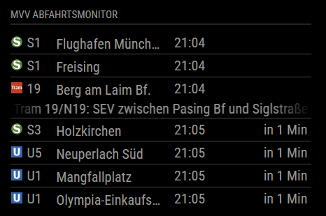

# MMM-MVVWiesty [](https://github.com/wiesty/MMM-MVVWiesty/raw/master/LICENSE) 

MagicMirror² Module to display public transport from Munich  in Germany.





## Dependencies
* instance of [MagicMirror²](https://github.com/MichMich/MagicMirror)

## Installation
1. Clone this repository in your MagicMirror installation into the folder modules.
```git clone https://github.com/wiesty/MMM-MVVWiesty.git```
2. Install dependencies in main MagicMirror folder
3. Head over to [mvv-muenchen.de](https://www.mvv-muenchen.de/fahrplanauskunft/fuer-entwickler/opendata/index.html) and download Haltestellenliste CSV
4. Search your station and modify the config template below
5. Add configuration to your config.js

## Config


```
{
    module: "MMM-MVVWiesty",
    position: "bottom_left",
    config: {
        updateInterval: 300000, // update interval in ms (here: 5 min)
        maxEntries: 5, // Maximum number of entries displayed in the table
        stopId: "de:09162:6", // Stop ID
        filter: {}
    }
},
```

#

### Filter by Line and Direction
You can filter departures by both line number and direction. To do so, add the line numbers as keys and the desired directions as values in the `filter` object in your module configuration. (Be sure to type the exact name of the line number and for the for the direction. TRAM and BUS only have Numbers. (Tram 16 would be "16", and BUS 123 would be "123")

Example:


    filter: {
      "S8": "Herrsching",
      "U2": "Messestadt Ost"
    } 

With the above configuration, the module will only display departures for the S8 line going towards Herrsching and the U2 line towards Messestadt Ost.

### Filter by Line Only

If you want to display departures for certain lines regardless of their direction, simply provide the line number with an empty string as the value. For example:


`filter: {
  "16": "",
  "S8": ""
}` 

This configuration results in the module showing all departures for the 16 and S8 lines, irrespective of their direction.

### Display All Departures

To show all departures without any filtering, you can either leave the `filter` object empty or include the key `all` with an empty string as its value. Both of these configurations will display every departure:

`filter: {
}` 

Or:

`filter: {
  "all": ""
}` 

This flexible filtering system ensures that you can always access the departures that are most relevant to you without any unnecessary clutter.
